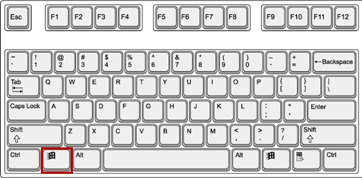

# Windows key not working

Windows key is a key found on IBM compatible keyboards used with the Microsoft Windows operating system. The Windows key has the Microsoft logo on it and is found between the left Ctrl and Alt keys on the keyboard. Pressing the Windows key by itself opens the Start menu that also displays the search box.

Holding down the Windows key and pressing another key, to trigger a keyboard shortcut, can speed up common tasks. For example, the keyboard shortcut Windows key+E (press and hold the Windows key and then, while holding that key, press the E key, and then let go of both buttons) opens Windows Explorer. For a full list of Windows key shortcuts, see the Windows shortcut keys guide.

## Where is the Windows key on the keyboard?

As seen below, the Windows key is found between the Alt keys and Ctrl keys on both sides of the spacebar. Some PC keyboard manufacturers may substitute the Windows logo for another picture, but the key still functions the same. For example, some Linux users may put a Tux sticker over the Windows key or replace the key with a key that shows Tux.

## Windows key not working

This problem is related to either your PC settings including the software you have installed, or it could be tied to your keyboard itself. Your best bet is to try another keyboard if you have one. If the problem disappears that suggests you have a suspect key on the original keyboard. If the problem doesn’t go away you can assume it’s a Windows problem. Press Ctrl + Shift + Esc to bring up task manager. If the task manager does not come up, then you might have a malware problem.

A common reason for this problem is as seen on gaming keyboards. These keyboards have two modes; a standard mode and a gaming mode. There is a switch to change between these modes. You might flip a switch, press a button, use the software, or use a combination to toggle between the modes. The gaming mode stops the Windows key from working to prevent your game from exiting when the Windows key is accidentally pressed.

There is also a possibility that your Windows key is disabled within the Windows OS registry editor itself, hence Windows is not able to accept a request by this key. A disabled start menu will also show this problem. This could have been done by some software, game, or malware.

Bad drivers, incompatible drivers, or outdated drivers can also cause your keyboard to freeze your Windows key. These symptoms can also be manifested if File Explorer/Windows Explorer, which drives your user interface, did not start correctly. There could also be a conflict between devices as seen when the game controller is plugged in.

In the worst cases, your keyboard could be mechanically or electrically damaged hence needing replacement. Here are solutions that could get you back on track.

**Since Windows Shortcuts will not work because of this error, we are going to use longer methods instead of windows shortcuts that require the Windows Key.**

* Disable Gaming Mode on your Keyboard
* Enable Windows Key using Registry Edit
* Re-Register all Apps
* Enable the Start Menu
* Restart Windows / File Explorer
* Turn off Filter Keys
* Uninstall and reinstall your keyboard drivers
* Unplug your game controller
